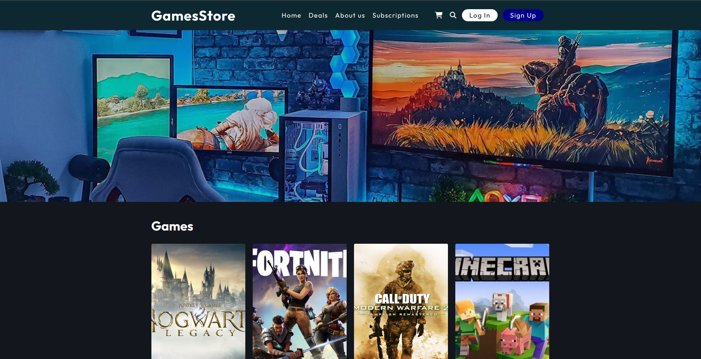
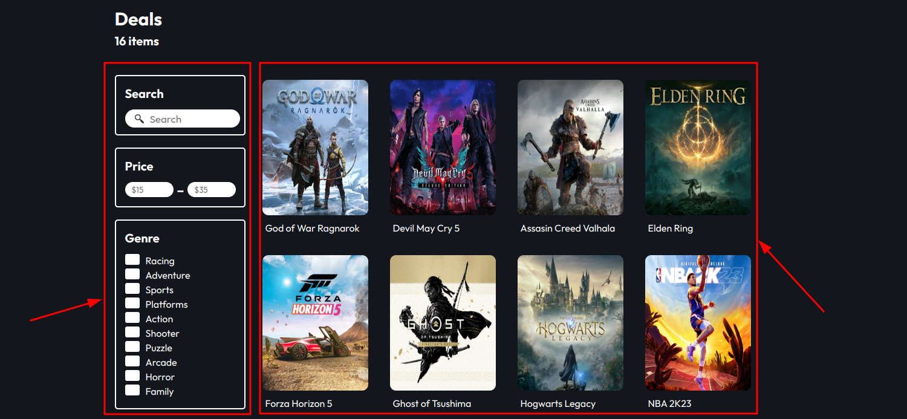
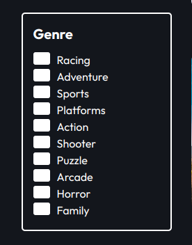
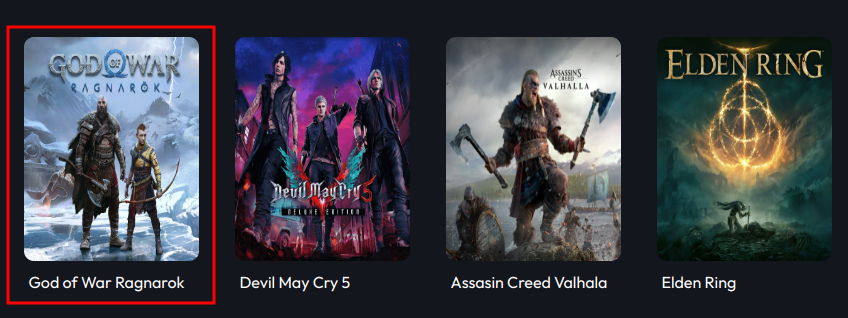
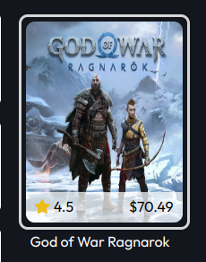

## Web development project  
This is a website created to sell games for different types of consoles such as ps4, ps5, xbox, nintendo and pc. Once you enter the page you will find 4 sections, those are:

- The games section,where you can check many of the games that are for sale.
- Subscriptions that can be purchased.
- A page to contact us in case of any issue with the page.
- A section to learn a little about those who developed the page and what services we provide to the users.



This website was the final project that I did together with my 2 colleagues from MITT for our introduction to web development course.This project included several challenges, mainly of those , generating the styles of the application, when the page that shows the games that are to be sold was created, adjusting the columns between the filters and the games of the catalog was a somewhat challenging job but it was also very interesting to do, in addition to that, generating the style for each game in the catalog and the search filters next to the games section was a really difficult task to do.

Here are some examples of some pieces of code that were really difficult to make:

* ###  **Generate two columns on the page (filters and games)**

    ```CSS
    .columns-alignment{
        display: flex;
        justify-content: space-between;
    }
    .games-filters{
        width: 20%;
    }
    .games-deals{
        width: 80%;
        margin-left: 20px;
    }
    ```

    ##### Description
    The names .games-filters and .game-deals represent the filters section and the game catalog section on the page, which are containers where the images and search filters will be placed to be able to see the games, with this in mind we can continue saying that several properties that css has were used to be able to modify the style of the objects on the web page, in the case of this example **width** was used to modify the width that each object can have, that is,because the games section has to be bigger than the filters section, and also the margin-left property to indicate a small margin that the games catalog will have with the other sections on the right side, finally the name .colums-alignment was used to identify the part of the code that It will generate 2 columns and allow the filters and the game catalog to share the same space.

    ##### Result
  
      

* ### **Generate the style for checkboxes in the filter section**
    ```CSS
    .boxes-filters input[type="checkbox"]{
      width: 18px;
      height: 18px;
      border: 2px solid var(--app-general-color);
      background-color: var(--app-general-color);
      float: left;
      border-radius: 3px;
      margin-right: 10px;
      cursor: pointer;
    }
    
    .boxes-filters input[type="checkbox"]:checked{
      background-color: var(--app-dark-bg);
    }
    ```
    ##### Description
    In order to identify the checkboxes that will be on the filters section , we use the name .boxes-filters indicating the object that contains those objects and following this we use input[type=checkbox] to identify the checkboxes, following this we establish The properties that we will use to generate the checkbox styles starting with the length and width of each checkbox (width and height), continuing with the border of the checkbox and the background color that each box will have and how circular the square will be. its corners (border-radius, background-color, border), we also establish the style for when the checkbox is selected using the identifier .boxes-filters input[type="checkbox"]:checked.
    ##### Result
  
      


* ### **Generate style to the images of the game catalog**

    #### HTML
    ```HTML
    <figure class="column">
     	<div class="image image-1">
            <div class="price">
                <p><span><i class="fa-solid fa-star"></i></span> 4.5</p>
                <p>$70.49</p>
            </div>                        
        </div>
        <figcaption>God of War Ragnarok</figcaption>
    </figure> 
    ```
    #### CSS
    ```CSS
    figcaption{
    margin:10px 5px 10px;
    color: var(--app-general-color);
    font-weight: 400;
    }
    
    .image-1{
    background: #000 url("../img/godofwar5.jpg");
    background-size: 100% 100%;
    background-repeat: no-repeat;
    }
    ```
    ##### Description
    In the html, only a container with the name column is created, likewise another container is used to save the images of each game with the name of each game and a name is established to identify them for when they are styled. to each object, in this case it will be image and image-1, after that we proceed to establish which image to use as well as the size that the image will occupy in the container.
    Following this we establish the size of the letter used as the name of the image and the margin that said text will have.
    ##### Result
  
     

* ### **More styles for the game catalog images**
    
    ```CSS
    .column:hover{border:3px solid var(--app-img-borders-color);}
    .column .image:hover .price{background-color:rgba(255, 255, 255,0.7);}
    .column .image:hover .price p{color:var(--app-dark-bg)}
    .column .image:hover .price i{color: #eabd1a;}
    ```
    ##### Description
    This piece of code was used to give a style to each image of the game catalog, mainly when the cursor lands on the image, a mini-section will be displayed with the price and rating of each game, for this the :hover instruction as shown in the code.
    ##### Result
  
     


### Improvements 
So far it is just a web page that uses HTML and CSS but it is not fully functional, so as an improvement I would definitely use javascript in order to give the respective functionality to the page and with this much more pleasant for the user also i would like to add more  sections and change some things with the game catalog section.
